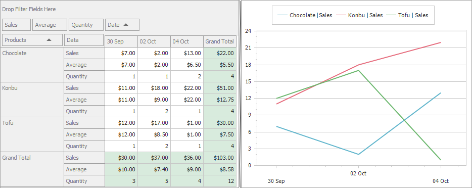

<!-- default badges list -->

<!-- default badges end -->
<!-- default file list -->

# WinForms - How to hide unnecessary series from the chart (Pivot - Chart Integration) 

This example demonstrates how to hide unnecessary series from the Chart control connected to the Pivot Grid.

## Files to Review

* [Form1.cs](./CS/WindowsApplication53/Form1.cs) (VB: [Form1.vb](./VB/WindowsApplication53/Form1.vb))
* [Program.cs](./CS/WindowsApplication53/Program.cs) (VB: [Program.vb](./VB/WindowsApplication53/Program.vb))
<!-- default file list end -->

## Example Overview

## Documantation

## More Examples 

- [WinForms - Customize Pivot Grid's Data before Displaying it in the Chart Control](https://github.com/DevExpress-Examples/customize-pivot-grid-controls-data-before-displaying-it-in-a-chart-control-e2214)
- [WinForms - Print a Document that Contains Pivot and Chart Controls](https://github.com/DevExpress-Examples/winforms-print-pivot-and-chart-controls)

